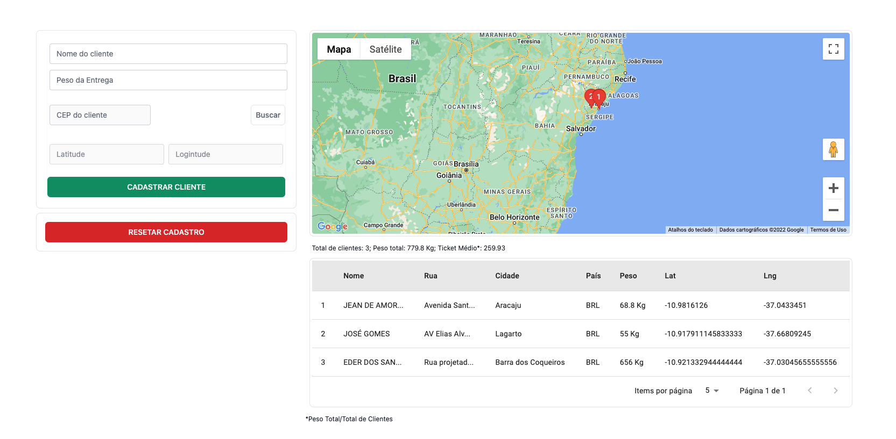

# Description
Desafio da uhuu

Seguem abaixo algumas instruções de como realizar a configuração do desafio da empresa uhuu.

1 - Antes de começar você precisa instalar o docker e o docker-compose para rodar a api:

* Docker: https://docs.docker.com/engine/install/ubuntu/
* Docker compose: https://docs.docker.com/compose/install/

## Installation da api

2 - Clone o repositório em qualquer pastas do seu PC --- git clone https://github.com/jeanamorim/fullstack-challenge.git

3 - Entre na pasta da api com o nome cd uhuu_nodejs e no terminal dê um npm install or yarn para instalar todas as dependências.

4 - Em seguida dê um docker compose up --build para rodar sua aplicação no docker --- obs: o docker precisa está instalado no seu PC e rodando. Aguarde até baixar todas as imagens necessárias.

Se dê tudo ok, sua aplicação ja estará rodando na porta http://localhost:3000/

## documentação da api com Swagger

5 - Na mesma porta que está rodando a api passe um /swagger para abrir o swagger e poder cadastrar nas rotas http://localhost:3000/swagger

Segue as rotas:

Cadastrar: 

CLIENT/CREATE -- criar um cliente com suas coordenadas e endereço

CLIENTE/LIST  -- listar todos os registro paginados

CLIENT/:ID -- listar apenas um cliente

CLIENT/DELETE -- Deletar todos os cientes do BD

CLIENT/GEOCODE/CEP -- Buscar a localização do registro junto com o endereço

## Installation do front-end

1 - Entre na pasta cd uhuu_reactjs a partir da raiz do projeto.

3 - No terminal dê um npm install or yarn para instalar todas as dependências.

4 - Em seguida dê um yarn dev para rodar o front end localmente.

5 - No seu navegador acesse http://localhost:3005/.

Pronto o front end estará rodando localmente

--------------------------------------------------------

## Sobre o desafio

O usuário deverá estar habilitado a cadastrar os clientes no formulário, e ao salvar, atualizar o mapa com o ponto (pin) daquele cadastro e a tabela com os dados do cliente. Na tabela contém um botão para excluir todos os dados, que remove tudo do banco, mapa e tabela.

## Tecnologias utilizadas

Para o front: 

 - Reactjs com Nextjs

 - Tailwind CSS

Para o Back: 

- node.js com nestjs

- docker-compose

- Prisma

 - Banco postgresql

